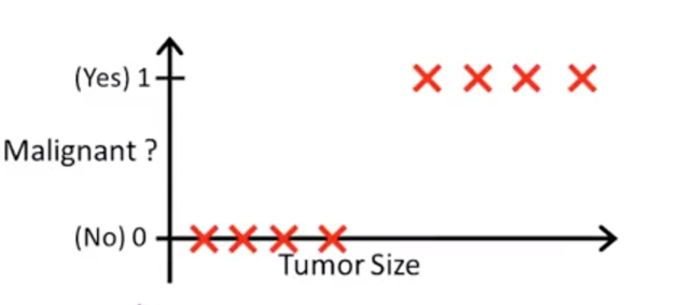
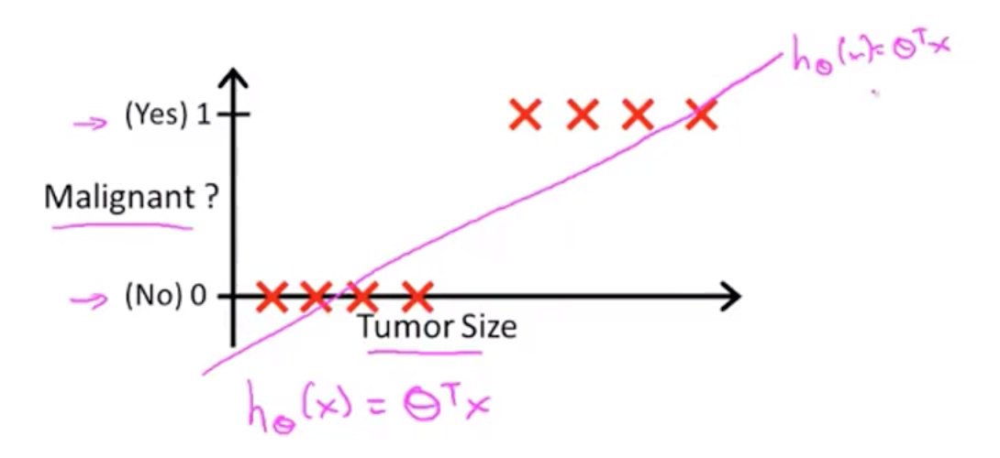
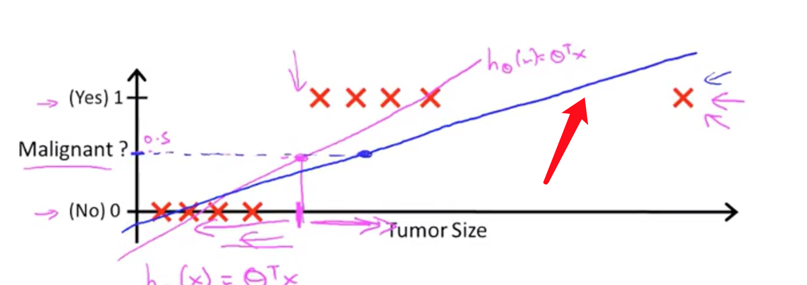
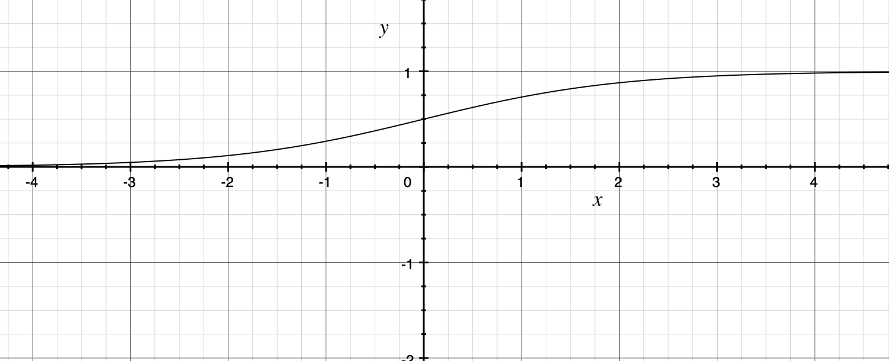
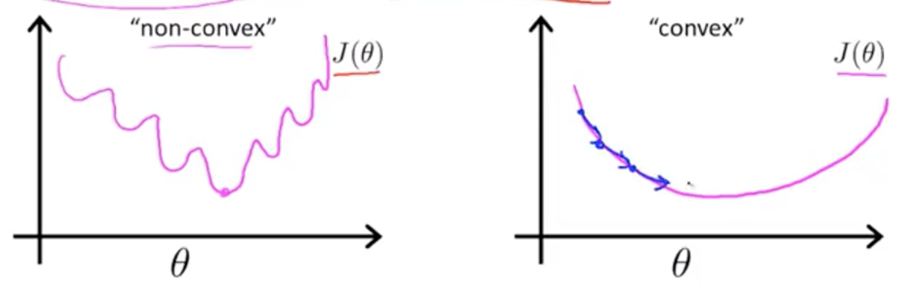
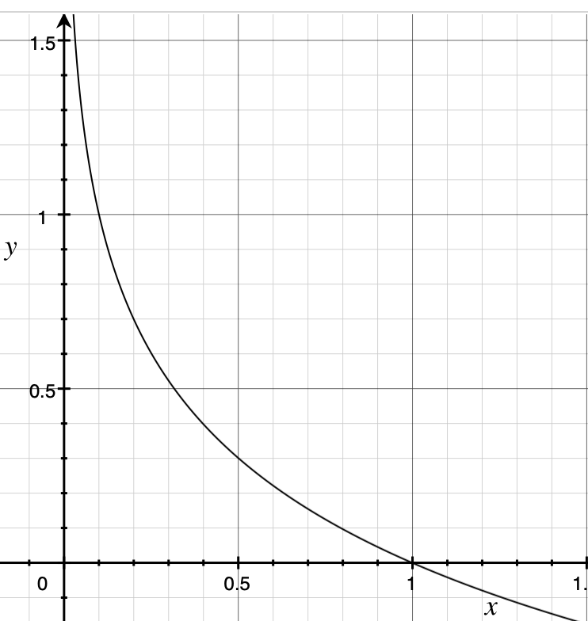
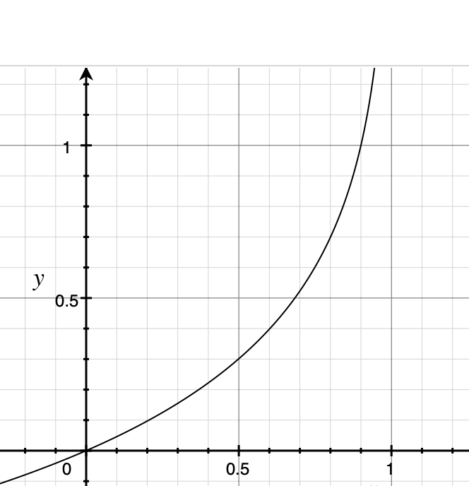

## 分类

> 要预测的变量$y$ 是一个离散值情况下的分类问题 

## logistic回归算法(logistic regression)

分类的一些例子:

+ 邮件 : 垃圾邮件 / 非垃圾邮件
+ 在线交易 : 是否欺诈 
+ 肿瘤: 良性 / 恶性 

在分类问题中, 对于预测值y都有两个取值的变量  $y \in \{ 0, 1\}$ 

+  0  negative class  通常代表没有某种东西
+ 1  positive class    通常代表我们要寻找的东西

> 通常0,1代表怎样的,没有明确的规定, 也不重要

**分类类型 :**

$y\in\{1, 2\}$   binary classification problem 

 $y \in \{0, 1, 2 , 3\}$ 则是 mutli-class classification problem

### So 如何开发一个分类的算法 ?

 上图是对应处理肿瘤得到的数据. 肿瘤是否为恶性只有两个值,  1(Yes), 0(No)  , 如果使用直线对数据进行拟合, 

会得到这样一条直线,

$$h{}(x) = \theta^{T}X$$

+ 如果 $h_{\theta}(x) \geq 0.5$ 则 y = 1

+ 如果 $h_{\theta}(x) \leq 0.5$ 则 y = 0

使用线性回归貌似能解决分类问题.    

假如, 有一个样本数据在横轴很右边处,  得到的拟合直线如下

 

 如果现在将阈值设置为0.5, 这时阈值点 左侧 有些明显不准确.  所以将线性回归应用于分类问题并不好.  

 进行分类 需要  y = 1 或者 y = 1, 然而: $h_\theta(x)$ 可能大于1 或者 小于 0 ; 

### logistics regression  

进行分类需要 $0 \geq h_\theta(x) \leq 1 $  ,  假设 function  $0 \geq  g(x) \leq 1 $ . 则 可以保证   $g(h_\theta(x))$ 大于0 并且小于1 

,  Sigmoid function  $g(z) = \frac{1}{1 + e^{(-z)}} $   取值在 0到1 之间. 

$h_{\theta}(x) = \theta^{T} x$ , $g(z)$的值在0到1 之间, 所以,  $g(\theta^{T} x)$ 值在0到1之间.  

 将其代入 sigmoid fucntion 得到新的 hypothesis function :

$$h_{\theta}(x) = \frac{1}{1 + e^{-\theta^{T}x}} $$

**hypothsis function  输出的值,将当做 当x 等于某个值时, y = 1的概率**

假如 $h_{\theta}(x) = 0.7$ 对与输入特性$x$ 有 70% 的可能 预测值y = 1.  

更加正式的概率表达 : $$h_{\theta}(x) = P(y = 1 |x;|\theta)$$ 

 

$h_{\theta}(x)$ 表示对与给定条件$x$ $\theta$ 是$y = 1$ 的概率 , 而对与分类 y 必须为1 或者为 0, 所以对 对与给定条件$x$ $\theta$ , 输出值y 等于0的概率可以表示为 :  $P(y = 0 |x;|\theta) = 1 - P(y = 1 |x;|\theta)$  

 

###  决策边界(decision boundary) 

 logistic regression :

+  hypothesis function : $h_{\theta}(x) = g(\theta^{T}x)$

+ sigmoid functin : $g(z) = \frac{1}{1+ e ^{-z}}$

   

 

**对与 hypothesis function 为 sigmoid functin 时  输出值 $y$ 何时为1, 何时为 0 ?**  

sigmoid function 的输出值为 y =1 时的概率,  所以 : 

+ 当 $h_\theta(x) \geq 0.5$ 时 $y = 1 $ 
+ 当 $h_\theta(x) < 0.5 $ 时 $y = 0$ 

### 损失函数(cost Function)

>  如何拟合模型参数${\theta}$ ?

已知: 

+ Training Set : $\lbrace  (x^{(1)}, y^{(1)}),  (x^{(2)}, y^{(2)}), ... , (x^{(m)}, y^{(m)}) \rbrace$

+ m examples :  $ x \in \begin{bmatrix} x_{0}\\ x_{1}\\ ...\\x_{n}  \end{bmatrix}  x_{0} = 1, y \in \lbrace 0, 1 \rbrace  $   

+ $h_{\theta}(x) = \frac{1}{1 + e^{-\theta ^{T} x}} $

如何选择参数$\theta$ ? 

损失函数 : 

+ 线性回归 :  $J(\theta) = \frac{1}{m} \sum_{i=1}^{m } \frac {1}{2} (h_{\theta}(x^{i} - y^{i})^{2}  $

$Cost(h_{\theta}(x),y) = \frac {1}{2} {(h_{\theta}(x) - y) ^ 2}$

 在logistics回归中使用 这个函数作为代价函数, 是一个非凸函数, 

非凸函数有很多局部最优解, 很难找到全局最优解. 

logistic regression cost function : 

$$Cost(h_{\theta}(x),y ) =  \begin{cases} -log(h_{\theta}(x)) \qquad  \qquad   y = 1 \\  -log(1-h_{\theta}(x))  \qquad y = 0 \end{cases}$$

当 y =1 时 :

当 $y = 1, h_{\theta}(x) = 1$ 时 cost 等于 0 

当 $y = 1, h_{\theta}(x) = 0$ 时 cost 趋于 $\infty$

当 y = 0 时:

当$y = 0, h_{\theta}(x) =0 $ 时 cost = 0 

当$y = 0, h_{\theta}(x) =1 $ 时 cost 趋于 $\infty$ 

