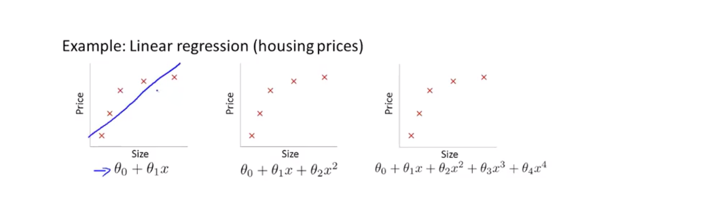

## 过拟合(overfitting)

### 什么是过拟合问题 ?

在房价预测的例子中,使用线性函数拟合数据,  可以看到 随着size的增大, 房价趋于稳定, 越往右 越平缓. 所以这个算法没有很好的拟合训练集, 我们把这个问题称为**欠拟合(underfitting)** .  也可以说这个算法有 **高偏差(high bias)** 

在第二张图中, 使用二次函数来拟合数据集, 可以很好的拟合数据.

在第三张图中, 使用四项式方程, 一共有5个参数,可以拟合一条曲线,通过全部5个训练样本 

